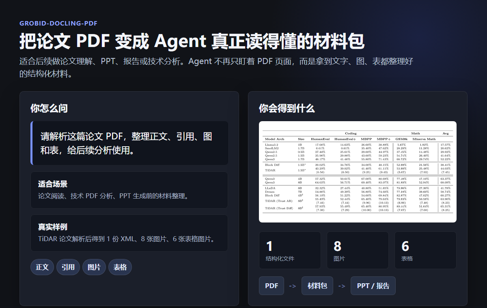

# 能力展示

这个 skill 解决的是论文 PDF 不好直接交给 Agent 深度使用的问题。它会把 PDF 整理成一个材料包，让 Agent 后续可以更稳定地做论文理解、PPT、报告或技术分析。



## 它适合做什么

- 把论文 PDF 拆成更适合 Agent 阅读的材料。
- 保留正文、章节、引用和参考文献。
- 把论文里的图和表单独整理出来。
- 为后续 PPT 生成、论文综述或技术分析准备输入。

## 你会怎么用

你可以直接这样说：

```text
请解析这篇论文 PDF，整理正文、引用、图和表，给后续分析使用。
```

或者：

```text
请把这篇技术 PDF 变成 Agent 可以继续处理的结构化材料包。
```

## 你会得到什么

最终会得到一份论文材料包：

- 一份可供 Agent 读取的结构化正文。
- 单独导出的图片和表格。
- 一份中间结果归档，方便需要时追溯解析过程。
- 一份解析是否完整的检查结果。

## 一个真实展示

截图里的样例来自 TiDAR 论文解析结果。这个材料包里包含 1 份结构化文件、8 张图片和 6 张表格图片。对使用者来说，重点不是它用了什么解析器，而是：PDF 终于变成了后续 Agent 工作可以直接复用的材料。
